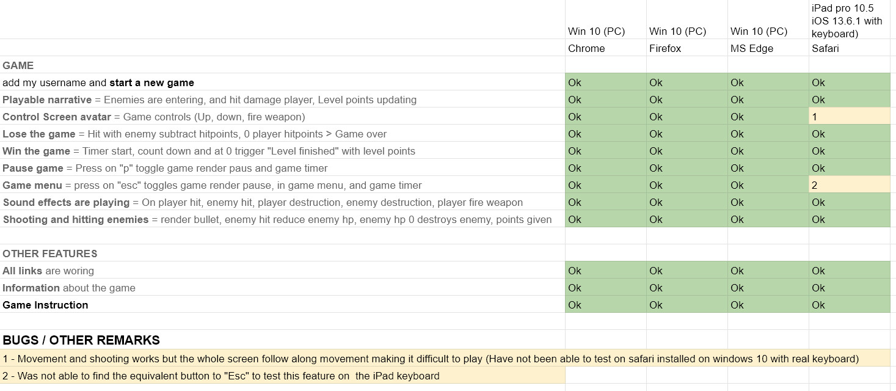

# SPACE INVADERS MARK ZERO

## A CODE INSTITUTE STUDENT PROJECT

## Project #2 - User-Centric Frontend Development

<a href="https://ifooledme.github.io/Space-Invaders-Mark-Zero--Code-Institute-project-2/">
VIEW THE LATEST LIVE VERSION HERE
</a>
 
#### QUICKSTART
- In the main menu click "New game"
- Select a user-/screen name and klick "Start"
- In the game use UP- and DOWN-arrow to move your spaceship up and down to avoid the incoming meteorits. Press SPACE to shoot at incoming enemies and try to destroy them.

<strong>PLEASE NOTE!</strong> This game is developed for desktops/laptops with the keyboard as game control, and for the latest versions of the most popular browsers (Google Chrome Version 83.0.4103.106, Microsoft Edge Version 83.0.478.54, Firefox version 77.0.1 and Opera Version 68.0.3618.173.
(I do not have access to a OS X computer so no testing has been done on the Safari browser).

#### THIS IS AN EDUCATIONAL PROJECT

This is the second of four individual projects we are to make during the 3 months Full Stack Developer course at Code Institute. Beside HTML5 and CSS3 this project is restricted to use of Javascript.

Since this stage of the course is mostly about Javascript, my idea is to make a small game using the HTML5 canvas element. This approach assures that most focus falls on Javascript. I am not using anything other than ”Vanilla” javascript and JQuery (and of course HTML and css with Bootstrap framework).

As this Project is done as part of an educational program. I have without any regards for potential copyright infringements and such legal stuff, used and sometimes modified resources I found freely. Please don’t sue me! (All images, snippets of code and other resources, guides, videos, and inspiration used and sometimes modified in/for this project are listed in the Credits Section at the bottom of this document).

## THE GAME

The game I intend to build is my own interpretation of the very classical game ”Space Invaders” (<a href="https://en.wikipedia.org/wiki/Space_Invaders" target="_blank"> Created by Tomohiro Nishikado 1978</a>). By making yet another version of this game there is nothing new. My interpretation just happens to be;

### "THE SPACE INVADERS MARK-ZERO"

-   “M A R K” - Because this project aims to leave some kind of mark in the history of Space Invaders clones (Think; “Just another poorly made broken bronze ax found in an archeological dig site still has its pretty small Mark in the history of bronze axes”).
-   “Z E R O” - Because at the moment coming up with the name for the game the project's mark on the history of “Space Invader Clones” was pretty much Zero. And besides, it just sounds cool!

### GAME CONTENT - WHAT IS IT ABOUT?

The game is about a small spaceship fighting obstacles and possibly enemies in a complete 2d environment. While the classical ”Space Invader” had a bottom/up perspective, my version goes from the left side of the screen where the player spaceship can move up and down (on the vertical axis). From the right side of the screen obstacles and enemies are appearing and move towards the player. These obstacles appear in various random positions, directions, speed, size and appearance. The player has to avoid being struck by these enemy objects, or the game is over. The player can shoot at these enemies to destroy them. You can find more details about the game content in the “Game & Rules” section in the application (reachable from from the main menu).

## FEATURES

### PRELOAD OF RESOURCES

All images used in the game are preloaded before opening the to the main menu (so that there is no risk of images not being loaded in the canvas). A preload page informs the user how many images are loaded out of the total to load.

 
 

### MAIN MENU

The main menu opens on top of the canvas as an absolute positioned element with a semi transparent background covering the complete screen.

 
 

### START A NEW GAME

When the user clicks on “New game” in the main menu, the player gets to choose a username for the game in a form. Clicking on “Start” starts a new game.

 
 

### THE GAME

The game is rendered in a html 5 canvas element in “2d” context calling “requestAnimationFrame” (a polyfill for browsers not supporting requestAnimationFrame is implemented but not fully tested).

 
 

#### CURRENT GAME FEATURES:

-   INCOMING ENEMY OBJECTS - Randomly created enemy objects move toward the player with various size, speed and location
-   PLAYER HEALTH POINTS - The player starts the game with a certain amount of health (for now set to 10). Each enemy hitting the player reduces the health points by a damage value calculated from speed and size of the enemy (larger and faster gives more damage).
-   PLAYER DESTRUCTION - If the players hit points reach 0, an explosion effect (for now a static image) triggers over the player spaceship, and over the enemy object causing the damage. This leads to “Game over” (see below).
-   SHOOTING BULLETS is done by pressing the “Space” key. A bullet hitting an enemy object reduces its hit points by a certain value (for now set to 1).
-   ENEMY DESTRUCTION - If the player's bullets hit an enemy object, a small explosion effect is triggered over the hit spot. If the enemy object's hit points reach 0, the object is destroyed and an explosion effect (for now a static image) triggers over the enemy.
-   ENERGY LEVEL - Each fired bullet from the player consumes a certain amount of energy (for now set to 1). The player has a certain amount of energy points at the start of each level. When the energy level reaches 0, there is not possible to fire any more bullets until an energy point has been recharged. Recharging of energy is done as soon as the energy level is less than the start amount. For now the Recharging of one energy point is set to 3 seconds.
-   LEVEL TIMER - is running in the information bar, informing the player of how long to stay alive until the next level.
-   CURRENT LEVEL - is updated on each new level.
-   GAME SCORE is updated on every frame.

 

### GAME OVER

When the players hit points reach 0, the “Game over” overlay gets visible and the game stops. The user can start a new game or return to the main menu.

 
 

### FINISHED LEVEL

When the level timer reaches 0, the “Finished Level” overlay gets visible with the total level game score shown, and the game stops. The user can start the next level or return to the main menu (At this release there are just one level in the game)

 
 

### IN GAME MENU / PAUSE

The player can reach the in game menu by pressing “Esc” key. The game pauses. From here the player can resume the game (by pressing “Esc” again or by pressing the "Resume" button, restart the game (from level 1) and get back to the main menu.
 
 

The player can also just pause the game by pressing the “P” key (Toggle back to continue the game with another press on “P” or “Esc” key).
 
 

## USER STORIES

-   “As a player I can add my username and start a new game”
-   “As a player I find it essential that there are some sort of playable narrative”
-   “As a player I find it essential that I can control my on screen avatar”
-   “As a player I must be able to lose the game”
-   “As a player I must be able to win the game”
-   “As a player I wish to get some more information about the game.”
-   “As a player I wish to get instructions on how to play.”
-   “As a player I would like to shoot at incoming objects making them disappear”
-   “As a player I wish to be able to Pause the game if I need to”
-   “As a player I expect the game to have some sound effects”

## TECHNOLOGY AND DEPLOYMENT

### TECHNOLOGIES USED

-   HTML 5 (With use of the Canvas Element rendering in “2d” context)
-   CSS 3 (With Bootstrap 4.5.0 and Popper 16.0)
-   Javascript (With JQuery 3.5.1)
-   Google Fonts for the various text styles
-   GitHub for version control
-   GitHub Pages for publishing
-   Visual Studio Code 1.46.1 as IDE
-   GIMP 2.10.14 for image manipulation

### DEPLOYMENT

The application is hosted on GitHub Pages:
https://ifooledme.github.io/SPACE-INVADERS-MARK-ZERO---Code-Institute-project-2/

The public repository on GitHub:
https://github.com/iFooledMe/SPACE-INVADERS-MARK-ZERO---Code-Institute-project-2

#### GET A GITHUB REPOSITORY

The steps below require you to have a GitHub account where to push this project up to. If you don’t have one already, go <a href="https://github.com/">here</a> and follow the instructions for setting up a new account and install git bash locally on your computer locally in order to submit Git-commands in your terminal.

#### HOW TO RUN THIS PROJECT LOCALLY

If you wish to deploy this project of your own take the following steps to clone this project to your own working directory:

1. In this repository (as you’re reading this readme in it :-) on the top right click the green “Code” button.
2. Copy the given url by clicking on the copy icon (or open it up with GitHub Desktop if you have it installed)
3. In your local IDE open Git Bash (or whatever terminal you use to work with Git)
4. Change the current working directory to the location where you want the clone to be created
5. In the terminal type “git clone” and the paste the url you just copied
6. Press Enter. Your local clone will be created in the working directory you’re currently in
7. Find more details about this procedure <a href="https://docs.github.com/en/github/creating-cloning-and-archiving-repositories/cloning-a-repository" target="_blank">here</a>

#### PUSH THE PROJECT UPON A GIT REPOSITORY

If you wish to deploy the project on GitGub pages, first take the following steps:

1. In Git Bash (or any other terminal where you issue Git commands), go to the root directory of the project you just cloned (above)
2. Then type “git init .”
3. Make some small changes to some file (for instance this readme file) in order to have something to commit and push to GitHub.
4. Then type command ‘ git add . ‘ to stage all files in the project for commit.
5. Then type command ‘ git commit -m “a message of you choosing” ‘
6. Then type command ‘ git push ‘ to push the project with all of it’s content to your git repository

#### DEPLOY THE PROJECT ON GITHUB PAGES

To deploy the project on GitHub Pages take the following steps:

1. In your repository on GitHub, go to settings.
1. Choose menu option “Manage Access” and make the repository public (You will need to type your GitHub password to access this area)
1. Then scroll down a bit to the section GitHub Pages, and in the dropdown menu for “source”, currently saying “none”, select the branch “master”, leave the second dropdown as it is (on /(root))
1. Now click the save button and the top of the section should now say: “Your site is ready to be published at (web address)”.
1. At this web address you find your newly deployed project (note it might take a couple of minutes before the deployment takes effect).

## TESTING

The test is done manually in the following browsers:

-   Google Chrome 84.0.4147.89 (on PC Windows 10)
-   Microsoft Edge Chromium 84.0.522.44 (on PC Windows 10)
-   Firefox 78.0.2 (on PC Windows 10)
-   Safari (on iPad pro 10.5 iOS 13.6.1 with keyboard)

The testing is done from the perspective of each user story (presented above). The game features are also broken down to separate parts to ensure they work as intended on each of the browsers. Since this game is intended for use on larger screens with keyboard as input, no testing has been done on touch-devices or on screens less than bootstrap md breakpoint (less than 768px width).

The test protocol can be accessed separately in a pdf file <a href="readme_img/test.pdf">HERE</a>

## UX

### GOAL - OBJECTIVE

The goal with this project is to build a small simple Game that is good enough to pass as playable. “Playable” of course is quite subjective. What is a good and fun game to play? Let’s face it! The game I’m building in the first version is going to be very simple and most likely for most users quite boring. But that’s what I am going to make. I will not try to define what playable means, who am I to determine that? But I have some ideas and I think they fall within the borders for plain common sense. Is there any narrative at all (how ever simple)? Does it Move and is controllable? Can You lose? Can You win? That's it for a first very simple minimal viable product.

### SCOPE

#### MUST FEATURES (Implemented)

These features are essential for a "Minimal Viable Product". All features in this category will build the First version of the Game "Mark-Zero-1". It is a game and it must be playable (This is of course a matter of personal opinion - The game will in this release be “playable” but most likely very simple and quite boring!)

-   Canvas - A canvas with context where the game is rendered (DONE!)
-   Player Object - Represented on the screen as a spaceship at the left side of the canvas (DONE!)
-   Enemy Objects - Moves from right to left on the horizontal axis. Random object type, size,speed and start position. (DONE!)
-   Collision detection - function to check if any enemy has hit the player (DONE!)
-   Game Over - Stop gameLoop and function / screen to show when game is lost (DONE!)
-   Win game - Stop gameLoop and function / screen to show when game is won (DONE!)
-   Total Game Score - Each enemy object passing without hitting the player adds a certain amount to total Score (Viewed somewhere) (DONE!)
-   Main Game Menu - A main menu as an absolute positioned div on top of the canvas with links to: (DONE!)
    -> New Game -> Text input for username -> Start game
    -> Game Info
    -> Game Instructions
    -> Quit Game

### OTHER FEATURES (Implemented)

-   Fire weapon - The player can fire projectiles. If a projectile hit an enemy it will be destroyed (Adds to total score). Add to collision detection. (DONE!)
-   Pause / Restart - A function that pause and restart the game. (DONE!)
-   Sound - Add some music and sound effects. (DONE!)
-   Dynamically resize canvas - Function to resize the canvas dependent on users current screen resolution. (DONE! Easy fix so implemented it)

### OTHER NON IMPLEMENTED FEATURES (Did not make this release but possibly future ones)

-   Store game score to high scores list - A Json file where all scores are stored (one local for personal use and one external for global use) (NOT DONE!)
-   Enemy Fire - Enemies being able to shoot at the player (NOT DONE!)
-   Boss Fights - Boss fights at the end of each level. (NOT DONE!)
-   Moving Background - Background image (one large or several smaller) that moves from the right to left to increase the sense of movement. (NOT DONE!)
-   Animate game objects - Like rotation of enemy objects, explosions, player ship animation with movement etc. (NOT DONE!)
-   Auto Pause - Automatically pause the game if the screen gets too small (NOT DONE!)
-   Expanding the game Mechanics - Expanding on the game mechanics by adding health ponts, Weapon upgrades, Shields, items using power with cooldown to restore before use again etc. (NOT DONE!)
-   Adding a story - story with some sort of game main objective, broken down in Level sub-missions/objectives. (NOT DONE!)
-   Dynamically scale game content - Function to scale the game objects in the canvas dependent on users current screen resolution (so everything becomes smaller on smaller screens to make it playable).
-   Add mouse controls - Players can control the game and move the ship up and down with mouse movements, fire with left mouse click and adjust ”speed” (horizontal movement) with the mousewheel. (NOT DONE!)
-   Touch screen controls - Features to play the game on touch-screens. (NOT DONE!)
-   Scale to mobile devices - Scale the canvas to be playable on smaller mobile devices.
-   Pause Strategic View - Players are able to pause the game and chain certain automated events like targeting one or more enemies, shooting a missile for instance etc. (NOT DONE!)
-   Settings - Players can enter a settings section and change various gameplay settings. (NOT DONE!)

## STRUCTURE

### ONE PAGE

This application stays on one single html page.

### THE CANVAS IS THE MAIN-COURSE

The Canvas is the main feature, and will cover 100% of the screen (Possibly changing size dynamically depending on the user screen size).

### ALL OTHER FEATURES ON TOP WHEN NEEDED

The top of the screen will hold a in game hud, supplying the player with information about score, health etc., a button to the Game Main Menu and a button to Start and Pause the game. This will be an absolute positioned element opening on top of the canvas when a game is started and active.

All menus and information will also be supplied by absolute positioned elements that open up on top of the canvas when needed.

## SKELETON

### WIREFRAMES

No wireframes were produced for this project

### RESPONSIVE BREAKPOINTS

This game is currently limited to be played on larger screens (bootstrap md and up). Anything less than triggers a message to the user telling they need a wider screen to play.

## SURFACE

I have chosen a cartoony look, with bright variances of red and orange as expression text colors, combined with pure white text on the dark background. Most of the game resources are made out of images with appropriate look and feel to enhance this “cartoony” feel (See media listings in credit section below)

## CREDITS

### MEDIA

#### BACKGROUND IMAGES

Bg-space-2460x1700.jpg
SOURCE: Wallpapersafari.com - https://img.wallpapersafari.com/tablet/2560/1700/19/51/a415uP.jpeg

PLAYER-SPACE SHIP IMAGES
spaceship2.[_100x50 to _1000x50].png
SOURCE: Wallpapersafari.com - https://cdn.wallpapersafari.com/11/9/bn9KIi.jpg

ENEMY IMAGES
astroid1.[_20x20 to _400x400].png
SOURCE: Wallpapersafari.com - https://cdn.wallpapersafari.com/91/49/2uKRha.jpg

BULLET IMAGE
https://i.ya-webdesign.com/images/transparent-laser-green-4.png

EXPLOSION STATIC IMAGE
https://www.pinclipart.com/pindetail/iiJmJRw_explosion-clipart-starburst-transparent-background-explosion-clipart-png/

EXPLOSION ANIMATION IMAGES (Not fully implemented but they are there)
https://realtimevfx.com/uploads/default/original/2X/5/551788f5c773cf5a25af23f9e6eef43a43cf05c4.gif

SOUND EFFECTS
Laser1.mp3, explosion1.mp3, explosion2.mp3, explosion3.mp3, bulletHit1.mp3
@https://www.zapsplat.com/

notify.wav - Windows standard system

### CODE

PRE-LOAD SOURCE CODE
loadImages() in main.js (I only made some small changes to this code to fit my purposes).
SOURCE: Derek Leung - http://jsfiddle.net/DerekL/uCQAH/

GAME TIMER SOURCE CODE
timer() in main.js (I only made some small changes to this code to fit my purposes).
SOURCE: da vinci harsha - https://codepen.io/davinciharsha/pen/vGBXzR

REQUEST ANIMATION FRAME POLYFILL
Erik Möller. fixes from Paul Irish and Tino Zijdel @ https://www.paulirish.com/2011/requestanimationframe-for-smart-animating/

SOUND EFFECTS (MULTIPLE SIMULTANEOUS CHANNELS CODE)
Tim Cotten @ https://blog.cotten.io/playing-audio-resources-simultaneously-in-javascript-546ec4d6216a

### ACKNOWLEDGEMENTS

Thank you to my tutor for this course Cormac and to my for this project dedicated mentor Antonija for all support along the way!
